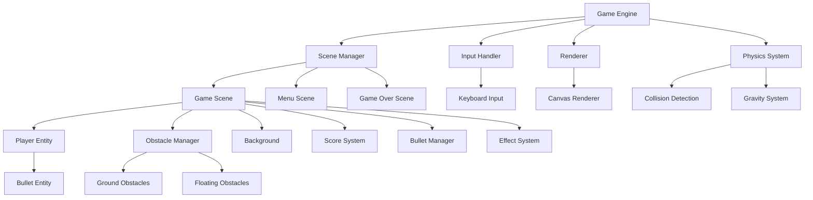

# 设计文档

## 概述

网页跑酷游戏是一个基于HTML5 Canvas的2D横版跑酷游戏。游戏采用模块化架构，包含游戏引擎、实体系统、输入处理、碰撞检测和渲染系统。玩家通过空格键控制角色跳跃，通过射击键发射子弹消除漂浮障碍物，躲避不断生成的障碍物，获得尽可能高的分数。

## 架构

### 整体架构图



### 核心模块

1. **Game Engine**: 游戏主循环和状态管理
2. **Scene Manager**: 场景切换和管理
3. **Entity System**: 游戏对象管理
4. **Input Handler**: 用户输入处理
5. **Physics System**: 物理模拟和碰撞检测
6. **Renderer**: 图形渲染和动画

## 组件和接口

### Game Engine

```javascript
class GameEngine {
  constructor(canvas)
  start()
  stop()
  pause()
  resume()
  update(deltaTime)
  render()
}
```

**职责：**
- 管理游戏主循环
- 协调各个系统的更新和渲染
- 处理游戏状态转换

### Scene Manager

```javascript
class SceneManager {
  constructor()
  addScene(name, scene)
  switchScene(name)
  getCurrentScene()
  update(deltaTime)
  render(renderer)
}
```

**职责：**
- 管理不同游戏场景（菜单、游戏、结束画面）
- 处理场景间的切换逻辑

### Player Entity

```javascript
class Player {
  constructor(x, y)
  update(deltaTime)
  jump()
  shoot()
  render(renderer)
  getBounds()
  isOnGround()
}
```

**职责：**
- 处理玩家角色的移动和跳跃
- 管理角色射击功能
- 管理角色动画状态
- 提供碰撞检测边界

### Bullet Entity

```javascript
class Bullet {
  constructor(x, y, direction)
  update(deltaTime)
  render(renderer)
  getBounds()
  isOffScreen()
}
```

**职责：**
- 处理子弹的移动和生命周期
- 提供碰撞检测边界
- 管理子弹的渲染

### Bullet Manager

```javascript
class BulletManager {
  constructor()
  addBullet(bullet)
  update(deltaTime)
  render(renderer)
  getBullets()
  removeOffscreenBullets()
}
```

**职责：**
- 管理所有子弹实体
- 处理子弹的生成和销毁
- 优化性能，清理离屏子弹

### Obstacle Manager

```javascript
class ObstacleManager {
  constructor()
  update(deltaTime)
  spawnObstacle()
  spawnFloatingObstacle()
  removeOffscreenObstacles()
  removeObstacle(obstacle)
  getObstacles()
  getFloatingObstacles()
  render(renderer)
}
```

**职责：**
- 管理地面和漂浮障碍物的生成和销毁
- 控制障碍物的移动速度
- 区分可射击和不可射击的障碍物类型
- 优化性能，移除屏幕外的障碍物

### Effect System

```javascript
class EffectSystem {
  constructor()
  addExplosion(x, y)
  update(deltaTime)
  render(renderer)
  removeFinishedEffects()
}
```

**职责：**
- 管理视觉效果（爆炸、消除动画等）
- 处理效果的生命周期
- 提供丰富的视觉反馈

### Input Handler

```javascript
class InputHandler {
  constructor()
  bindEvents()
  isKeyPressed(key)
  onKeyDown(callback)
  onKeyUp(callback)
}
```

**职责：**
- 处理键盘输入事件（跳跃、射击）
- 提供输入状态查询接口
- 支持事件回调机制
- 管理射击冷却时间

## 数据模型

### Game State

```javascript
const GameState = {
  MENU: 'menu',
  PLAYING: 'playing',
  PAUSED: 'paused',
  GAME_OVER: 'game_over'
}
```

### Player Data

```javascript
class PlayerData {
  constructor() {
    this.x = 100
    this.y = 0
    this.velocityX = 0
    this.velocityY = 0
    this.width = 32
    this.height = 32
    this.isGrounded = true
    this.animationFrame = 0
    this.animationSpeed = 0.2
  }
}
```

### Obstacle Data

```javascript
class ObstacleData {
  constructor(x, y, type) {
    this.x = x
    this.y = y
    this.width = 32
    this.height = 32
    this.type = type // 'ground' 或 'floating'
    this.speed = 200
    this.canBeShot = type === 'floating'
    this.health = type === 'floating' ? 1 : Infinity
  }
}
```

### Bullet Data

```javascript
class BulletData {
  constructor(x, y, direction) {
    this.x = x
    this.y = y
    this.width = 8
    this.height = 4
    this.speed = 400
    this.direction = direction
    this.damage = 1
  }
}
```

### Effect Data

```javascript
class EffectData {
  constructor(x, y, type) {
    this.x = x
    this.y = y
    this.type = type // 'explosion', 'destruction'
    this.animationFrame = 0
    this.maxFrames = 10
    this.animationSpeed = 0.3
    this.isFinished = false
  }
}
```

### Game Config

```javascript
const GameConfig = {
  CANVAS_WIDTH: 800,
  CANVAS_HEIGHT: 400,
  GRAVITY: 980,
  JUMP_FORCE: -400,
  PLAYER_SPEED: 200,
  OBSTACLE_SPEED: 200,
  BULLET_SPEED: 400,
  OBSTACLE_SPAWN_INTERVAL: 2000,
  FLOATING_OBSTACLE_SPAWN_INTERVAL: 3000,
  SHOOT_COOLDOWN: 300,
  GROUND_Y: 350,
  FLOATING_OBSTACLE_MIN_Y: 100,
  FLOATING_OBSTACLE_MAX_Y: 250,
  BULLET_DESTROY_SCORE: 50
}
```

## 错误处理

### 输入验证
- 验证Canvas元素存在性
- 检查浏览器Canvas支持
- 处理键盘事件绑定失败

### 资源加载
- 图片资源加载失败回退机制
- 音频资源可选加载
- 网络连接异常处理

### 游戏运行时错误
- 碰撞检测边界检查
- 动画帧越界保护
- 内存泄漏防护（及时清理离屏对象）

### 错误恢复策略
```javascript
class ErrorHandler {
  static handleCanvasError(error) {
    console.error('Canvas error:', error)
    // 显示错误提示，建议用户刷新页面
  }
  
  static handleGameLoopError(error) {
    console.error('Game loop error:', error)
    // 暂停游戏，显示错误信息
  }
}
```

## 测试策略

### 单元测试
- **Player类测试**: 跳跃逻辑、射击功能、碰撞边界、动画状态
- **Bullet类测试**: 移动逻辑、碰撞检测、生命周期管理
- **BulletManager测试**: 子弹生成、清理逻辑、性能优化
- **ObstacleManager测试**: 地面和漂浮障碍物生成逻辑、移除逻辑、性能优化
- **EffectSystem测试**: 效果生成、动画播放、清理逻辑
- **Physics System测试**: 重力计算、碰撞检测准确性、子弹碰撞
- **Input Handler测试**: 键盘事件处理、射击冷却、状态管理

### 集成测试
- **游戏循环测试**: 各系统协调工作验证
- **场景切换测试**: 状态转换正确性
- **性能测试**: 帧率稳定性、内存使用

### 用户体验测试
- **响应性测试**: 输入延迟测量
- **兼容性测试**: 不同浏览器和设备
- **可玩性测试**: 难度曲线和游戏平衡

### 自动化测试工具
```javascript
// 使用Jest进行单元测试
describe('Player', () => {
  test('should jump when on ground', () => {
    const player = new Player(100, 350)
    player.jump()
    expect(player.velocityY).toBeLessThan(0)
  })
})

// 使用Puppeteer进行端到端测试
describe('Game Integration', () => {
  test('should start game when space is pressed', async () => {
    await page.goto('http://localhost:3000')
    await page.keyboard.press('Space')
    const gameState = await page.evaluate(() => game.state)
    expect(gameState).toBe('playing')
  })
})
```

### 性能监控
- FPS监控和报告
- 内存使用跟踪
- 碰撞检测性能分析
- 渲染性能优化验证