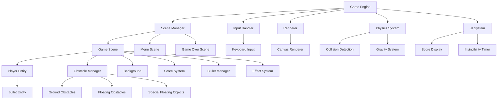

# 设计文档

## 概述

网页跑酷游戏是一个基于HTML5 Canvas的2D横版跑酷游戏。游戏采用模块化架构，包含游戏引擎、实体系统、输入处理、碰撞检测和渲染系统。玩家控制一个美女角色，通过空格键控制角色跳跃，通过射击键发射子弹消除漂浮障碍物，躲避不断生成的障碍物，获得尽可能高的分数。游戏主角采用精美的美女角色设计，提供更具吸引力的视觉体验。

## 架构

### 整体架构图


```mermaid
graph TB
    A[Game Engine] --> B[Scene Manager]
    A --> C[Input Handler]
    A --> D[Renderer]
    A --> E[Physics System]
    A --> F[UI System]
    
    B --> G[Game Scene]
    B --> H[Menu Scene]
    B --> I[Game Over Scene]
    
    G --> J[Player Entity]
    G --> K[Obstacle Manager]
    G --> L[Background]
    G --> M[Score System]
    G --> N[Bullet Manager]
    G --> O[Effect System]
    
    C --> P[Keyboard Input]
    D --> Q[Canvas Renderer]
    E --> R[Collision Detection]
    E --> S[Gravity System]
    F --> T[Score Display]
    F --> U[Invincibility Timer]
    
    J --> V[Bullet Entity]
    K --> W[Ground Obstacles]
    K --> X[Floating Obstacles]
    K --> Y[Special Floating Objects]
```

### 核心模块

1. **Game Engine**: 游戏主循环和状态管理
2. **Scene Manager**: 场景切换和管理
3. **Entity System**: 游戏对象管理
4. **Input Handler**: 用户输入处理
5. **Physics System**: 物理模拟和碰撞检测
6. **Renderer**: 图形渲染和动画
7. **UI System**: 用户界面管理和显示

## 组件和接口

### Game Engine

```javascript
class GameEngine {
  constructor(canvas)
  start()
  stop()
  pause()
  resume()
  update(deltaTime)
  render()
}
```

**职责：**
- 管理游戏主循环
- 协调各个系统的更新和渲染
- 处理游戏状态转换

### Scene Manager

```javascript
class SceneManager {
  constructor()
  addScene(name, scene)
  switchScene(name)
  getCurrentScene()
  update(deltaTime)
  render(renderer)
}
```

**职责：**
- 管理不同游戏场景（菜单、游戏、结束画面）
- 处理场景间的切换逻辑

### Player Entity

```javascript
class Player {
  constructor(x, y)
  update(deltaTime)
  jump()
  shoot()
  render(renderer)
  getBounds()
  isOnGround()
  setInvincible(duration)
  isInvincible()
  getInvincibilityTimeLeft()
  activateInvincibility(duration = 10000) // 10秒无敌时间
}
```

**职责：**
- 处理美女角色的移动和跳跃
- 管理角色射击功能
- 管理美女角色的动画状态（奔跑、跳跃、射击动画）
- 处理无敌状态的视觉效果（发光、闪烁）
- 管理10秒无敌状态的计时和倒计时提醒
- 提供碰撞检测边界
- 管理角色外观和动画资源

### Bullet Entity

```javascript
class Bullet {
  constructor(x, y, direction)
  update(deltaTime)
  render(renderer)
  getBounds()
  isOffScreen()
}
```

**职责：**
- 处理子弹的移动和生命周期
- 提供碰撞检测边界
- 管理子弹的渲染

### Bullet Manager

```javascript
class BulletManager {
  constructor()
  addBullet(bullet)
  update(deltaTime)
  render(renderer)
  getBullets()
  removeOffscreenBullets()
}
```

**职责：**
- 管理所有子弹实体
- 处理子弹的生成和销毁
- 优化性能，清理离屏子弹

### Obstacle Manager

```javascript
class ObstacleManager {
  constructor()
  update(deltaTime)
  spawnObstacle()
  spawnFloatingObstacle()
  spawnSpecialFloatingObstacle()
  removeOffscreenObstacles()
  removeObstacle(obstacle)
  getObstacles()
  getFloatingObstacles()
  getSpecialFloatingObstacles()
  render(renderer)
}
```

**职责：**
- 管理地面和漂浮障碍物的生成和销毁
- 控制障碍物的移动速度
- 区分可射击和不可射击的障碍物类型
- 管理特殊彩色漂浮物的生成（用于激活无敌状态）
- 支持不同类型的障碍物（basic、tall、wide）及其对应的得分系统
- 优化性能，移除屏幕外的障碍物

### Effect System

```javascript
class EffectSystem {
  constructor()
  addExplosion(x, y)
  update(deltaTime)
  render(renderer)
  removeFinishedEffects()
}
```

**职责：**
- 管理视觉效果（爆炸、消除动画等）
- 处理效果的生命周期
- 提供丰富的视觉反馈

### Input Handler

```javascript
class InputHandler {
  constructor()
  bindEvents()
  isKeyPressed(key)
  onKeyDown(callback)
  onKeyUp(callback)
}
```

**职责：**
- 处理键盘输入事件（跳跃、射击）
- 提供输入状态查询接口
- 支持事件回调机制
- 管理射击冷却时间

### UI System

```javascript
class UISystem {
  constructor()
  update(deltaTime)
  render(renderer)
  updateScore(score)
  updateInvincibilityTimer(timeLeft)
  showScorePopup(points, x, y)
  showGameOver(finalScore)
  showInvincibilityActivation()
}
```

**职责：**
- 管理游戏界面元素的显示和更新
- 显示当前得分和得分变化的视觉反馈
- 显示无敌状态剩余时间的倒计时
- 管理游戏结束界面和重新开始选项
- 显示无敌状态激活的特殊效果提示

## 美女角色设计

### 角色外观设计

**基本特征：**
- 现代时尚的美女角色设计
- 适合跑酷运动的服装（运动装或休闲装）
- 流畅的动画过渡和表现力丰富的动作
- 清晰的像素艺术风格，适合2D游戏

**动画状态：**
1. **奔跑动画**: 优雅的跑步姿态，头发和衣物的动态效果
2. **跳跃动画**: 起跳、空中、落地三个阶段的流畅过渡
3. **射击动画**: 射击时的瞄准姿势和后坐力表现
4. **无敌状态**: 特殊的发光或闪烁效果，突出无敌状态

### 视觉效果系统

```javascript
class CharacterEffects {
  constructor(player) {
    this.player = player
    this.glowIntensity = 0
    this.sparkleParticles = []
  }
  
  updateInvincibilityEffect(deltaTime) {
    // 无敌状态的视觉效果更新
  }
  
  renderGlowEffect(renderer) {
    // 渲染发光效果
  }
  
  addSparkleEffect(x, y) {
    // 添加闪烁粒子效果
  }
}
```

### 角色资源管理

```javascript
class CharacterAssets {
  constructor() {
    this.animations = {
      running: [], // 奔跑动画帧
      jumping: [], // 跳跃动画帧
      shooting: [] // 射击动画帧
    }
    this.effectTextures = {
      glow: null,
      sparkle: null
    }
  }
  
  loadAssets() {
    // 加载美女角色的所有动画资源
  }
  
  getCurrentFrame(animationType, frameIndex) {
    // 获取当前动画帧
  }
}
```

## 无敌状态系统设计

### 无敌状态激活机制

**设计决策：** 通过射击特殊的彩色漂浮物来激活无敌状态，而不是通过时间或其他方式获得。这样设计是为了：
- 增加游戏的策略性，玩家需要主动寻找和射击特殊目标
- 提供风险与回报的平衡，玩家需要冒险射击才能获得无敌状态
- 增强游戏的互动性和技巧要求

### 无敌状态管理系统

```javascript
class InvincibilitySystem {
  constructor(player, uiSystem) {
    this.player = player
    this.uiSystem = uiSystem
    this.isActive = false
    this.timeLeft = 0
    this.maxDuration = 10000 // 10秒
    this.warningTime = 3000  // 剩余3秒时警告
  }
  
  activate() {
    this.isActive = true
    this.timeLeft = this.maxDuration
    this.player.setInvincible(this.maxDuration)
    this.uiSystem.showInvincibilityActivation()
  }
  
  update(deltaTime) {
    if (this.isActive) {
      this.timeLeft -= deltaTime
      this.uiSystem.updateInvincibilityTimer(this.timeLeft)
      
      // 剩余时间少于3秒时开始闪烁提醒
      if (this.timeLeft <= this.warningTime) {
        this.player.enableBlinkEffect(true)
      }
      
      if (this.timeLeft <= 0) {
        this.deactivate()
      }
    }
  }
  
  deactivate() {
    this.isActive = false
    this.timeLeft = 0
    this.player.setInvincible(0)
    this.player.enableBlinkEffect(false)
  }
}
```

**职责：**
- 管理10秒无敌状态的激活和倒计时
- 协调玩家角色的无敌状态和视觉效果
- 在剩余3秒时提供闪烁提醒
- 在UI中显示剩余无敌时间
- 处理无敌状态的自然结束

## 数据模型

### Game State

```javascript
const GameState = {
  MENU: 'menu',
  PLAYING: 'playing',
  PAUSED: 'paused',
  GAME_OVER: 'game_over'
}
```

### Player Data

```javascript
class PlayerData {
  constructor() {
    this.x = 100
    this.y = 0
    this.velocityX = 0
    this.velocityY = 0
    this.width = 32
    this.height = 48  // 美女角色稍高
    this.isGrounded = true
    this.animationFrame = 0
    this.animationSpeed = 0.2
    this.currentAnimation = 'running'  // 'running', 'jumping', 'shooting'
    this.isInvincible = false
    this.invincibleTimeLeft = 0
    this.maxInvincibleTime = 10000  // 10秒无敌时间
    this.invincibilityWarningTime = 3000  // 剩余3秒时开始闪烁提醒
    this.characterType = 'beauty'  // 角色类型标识
    this.glowEffect = false  // 无敌状态发光效果
    this.blinkEffect = false  // 无敌状态即将结束时的闪烁效果
  }
}
```

### Obstacle Data

```javascript
class ObstacleData {
  constructor(x, y, type, subType = 'basic') {
    this.x = x
    this.y = y
    this.type = type // 'ground', 'floating', 'special'
    this.subType = subType // 'basic', 'tall', 'wide' (for ground obstacles)
    this.width = this.getWidthBySubType(subType)
    this.height = this.getHeightBySubType(subType)
    this.speed = 200
    this.canBeShot = type === 'floating' || type === 'special'
    this.health = (type === 'floating' || type === 'special') ? 1 : Infinity
    this.scoreValue = this.getScoreValue(type, subType)
    this.isSpecial = type === 'special' // 彩色漂浮物，激活无敌状态
  }
  
  getWidthBySubType(subType) {
    switch(subType) {
      case 'basic': return 32
      case 'tall': return 32
      case 'wide': return 64
      default: return 32
    }
  }
  
  getHeightBySubType(subType) {
    switch(subType) {
      case 'basic': return 32
      case 'tall': return 64
      case 'wide': return 32
      default: return 32
    }
  }
  
  getScoreValue(type, subType) {
    if (type === 'floating' || type === 'special') return 30
    switch(subType) {
      case 'basic': return 10
      case 'tall': return 20
      case 'wide': return 30
      default: return 10
    }
  }
}
```

### Bullet Data

```javascript
class BulletData {
  constructor(x, y, direction) {
    this.x = x
    this.y = y
    this.width = 8
    this.height = 4
    this.speed = 400
    this.direction = direction
    this.damage = 1
  }
}
```

### Effect Data

```javascript
class EffectData {
  constructor(x, y, type) {
    this.x = x
    this.y = y
    this.type = type // 'explosion', 'destruction'
    this.animationFrame = 0
    this.maxFrames = 10
    this.animationSpeed = 0.3
    this.isFinished = false
  }
}
```

### Game Config

```javascript
const GameConfig = {
  CANVAS_WIDTH: 800,
  CANVAS_HEIGHT: 400,
  GRAVITY: 980,
  JUMP_FORCE: -400,
  PLAYER_SPEED: 200,
  OBSTACLE_SPEED: 200,
  BULLET_SPEED: 400,
  OBSTACLE_SPAWN_INTERVAL: 2000,
  FLOATING_OBSTACLE_SPAWN_INTERVAL: 3000,
  SPECIAL_FLOATING_SPAWN_INTERVAL: 15000, // 特殊彩色漂浮物生成间隔
  SHOOT_COOLDOWN: 300,
  GROUND_Y: 350,
  FLOATING_OBSTACLE_MIN_Y: 100,
  FLOATING_OBSTACLE_MAX_Y: 250,
  
  // 得分系统配置
  SCORE_BASIC_OBSTACLE: 10,    // 小型障碍物得分
  SCORE_TALL_OBSTACLE: 20,     // 中型障碍物得分
  SCORE_WIDE_OBSTACLE: 30,     // 大型障碍物得分
  SCORE_FLOATING_OBSTACLE: 30, // 漂浮障碍物得分
  
  // 无敌状态配置
  INVINCIBILITY_DURATION: 10000,    // 无敌持续时间（10秒）
  INVINCIBILITY_WARNING_TIME: 3000, // 剩余3秒时开始闪烁提醒
  INVINCIBILITY_BLINK_INTERVAL: 200  // 闪烁间隔
}
```

## 错误处理

### 输入验证
- 验证Canvas元素存在性
- 检查浏览器Canvas支持
- 处理键盘事件绑定失败

### 资源加载
- 图片资源加载失败回退机制
- 音频资源可选加载
- 网络连接异常处理

### 游戏运行时错误
- 碰撞检测边界检查
- 动画帧越界保护
- 内存泄漏防护（及时清理离屏对象）

### 错误恢复策略
```javascript
class ErrorHandler {
  static handleCanvasError(error) {
    console.error('Canvas error:', error)
    // 显示错误提示，建议用户刷新页面
  }
  
  static handleGameLoopError(error) {
    console.error('Game loop error:', error)
    // 暂停游戏，显示错误信息
  }
}
```

## 测试策略

### 单元测试
- **Player类测试**: 跳跃逻辑、射击功能、碰撞边界、美女角色动画状态切换、无敌状态管理
- **CharacterEffects测试**: 无敌状态视觉效果、发光效果渲染、粒子效果、闪烁提醒效果
- **CharacterAssets测试**: 动画资源加载、动画帧切换、资源管理
- **Bullet类测试**: 移动逻辑、碰撞检测、生命周期管理
- **BulletManager测试**: 子弹生成、清理逻辑、性能优化
- **ObstacleManager测试**: 地面和漂浮障碍物生成逻辑、特殊彩色漂浮物生成、不同障碍物类型管理、移除逻辑、性能优化
- **EffectSystem测试**: 效果生成、动画播放、清理逻辑
- **Physics System测试**: 重力计算、碰撞检测准确性、子弹碰撞、无敌状态碰撞忽略
- **Input Handler测试**: 键盘事件处理、射击冷却、状态管理
- **UISystem测试**: 得分显示、无敌状态计时器、得分变化视觉反馈
- **InvincibilitySystem测试**: 无敌状态激活、10秒倒计时、3秒闪烁提醒、状态结束处理
- **ScoreSystem测试**: 不同障碍物类型得分计算、射击得分奖励、得分累计逻辑

### 集成测试
- **游戏循环测试**: 各系统协调工作验证
- **场景切换测试**: 状态转换正确性
- **性能测试**: 帧率稳定性、内存使用

### 用户体验测试
- **响应性测试**: 输入延迟测量
- **兼容性测试**: 不同浏览器和设备
- **可玩性测试**: 难度曲线和游戏平衡、无敌状态的策略性使用
- **视觉体验测试**: 美女角色动画流畅度、视觉效果吸引力
- **角色表现测试**: 动画切换自然度、无敌状态视觉反馈清晰度
- **得分系统测试**: 不同障碍物类型得分的合理性、得分反馈的及时性
- **无敌状态体验测试**: 10秒无敌时间的游戏平衡性、3秒倒计时提醒的有效性
- **UI可用性测试**: 无敌状态计时器的可读性、得分变化的视觉清晰度

### 自动化测试工具
```javascript
// 使用Jest进行单元测试
describe('Player', () => {
  test('should jump when on ground', () => {
    const player = new Player(100, 350)
    player.jump()
    expect(player.velocityY).toBeLessThan(0)
  })
})

// 使用Puppeteer进行端到端测试
describe('Game Integration', () => {
  test('should start game when space is pressed', async () => {
    await page.goto('http://localhost:3000')
    await page.keyboard.press('Space')
    const gameState = await page.evaluate(() => game.state)
    expect(gameState).toBe('playing')
  })
})
```

### 性能监控
- FPS监控和报告
- 内存使用跟踪
- 碰撞检测性能分析
- 渲染性能优化验证